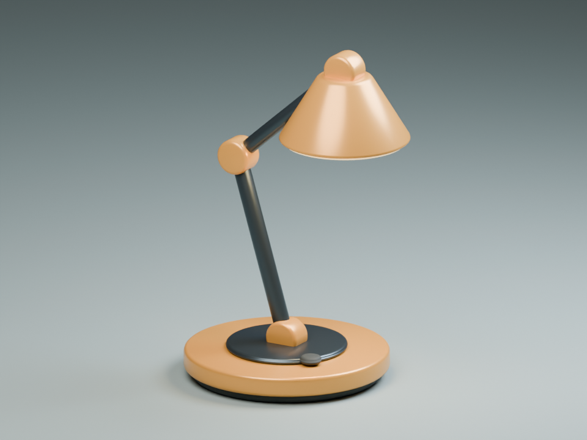

# Astral-Claude

**Give Claude Code a practical way to see, operate, and verify desktop applications.**

Astral-Claude combines reusable **skills**, a local **desktop MCP server**, and native
application workflows. Use it for Blender, an unfamiliar desktop editor, or work that crosses
several applications. It runs on your machine with your installed apps; it contains no
machine-specific paths, credentials, hosted service, or separate model API client.

```text
Your task → Claude Code + task-specific skill
                    ↓
       Choose a useful control surface
       ├─ App API / script / CLI → precise construction
       └─ Desktop MCP          → screenshot, mouse, keyboard
                    ↓
          Observe → act → inspect → correct
                    ↓
          Save → reopen / render → verify → deliver
```

The goal is dependable work: know the current state, use precise tools where they help,
inspect the result, and recover when reality differs from the plan. Skills guide decisions;
they do not change model weights or guarantee expert results in every application.

## Install in Claude Code

Install [Claude Code](https://code.claude.com/docs/en/setup) and
[uv](https://docs.astral.sh/uv/getting-started/installation/), with `uv` on the PATH visible to
Claude Code. Then run these commands **inside Claude Code**:

```text
/plugin marketplace add Hybirdss/Astral-Claude
/plugin install astral-claude@astral-claude
```

Restart Claude Code after installation. The plugin starts its stdio MCP server using `uv`,
the included dependency lock, and Python 3.12 (uv can download the interpreter). The first
launch needs network access for dependencies. No separate Anthropic or OpenAI API key is
required by this plugin; normal Claude Code account access and usage still apply.

Follow the [OS setup guide](docs/platforms.md) before trying desktop input. Use `/mcp` to check
that `astral-desktop` connected, then invoke:

```text
/astral-claude:computer-use Check desktop_status, then observe the screen.
Describe the active application before taking any input action.
```

To develop or try a local checkout (same commands in a terminal on all three OS families):

```text
git clone https://github.com/Hybirdss/Astral-Claude.git
cd Astral-Claude
uv sync --frozen --python 3.12
uv run --frozen astral-desktop doctor
claude --plugin-dir .
```

Use either an installed plugin or `--plugin-dir`, avoiding duplicate servers. If Claude Code
also offers to enable this checkout's project `.mcp.json`, decline that duplicate: its path
variable is resolved in plugin context. See [troubleshooting](docs/platforms.md#troubleshooting).

## What you get

| Component | Purpose |
| --- | --- |
| [`computer-use`](skills/computer-use/SKILL.md) | Select a control surface; observe, act, recover, and save |
| [`blender`](skills/blender/SKILL.md) | Use `bpy` precisely and judge actual renders |
| [`learn-app`](skills/learn-app/SKILL.md) | Discover an unfamiliar app and retain a tested procedure |
| [`verify-artifact`](skills/verify-artifact/SKILL.md) | Check native files, exports, and visible quality |
| [`astral-desktop`](src/astral_claude/server.py) | Screenshot, click, move, drag, scroll, keys, ASCII typing, Unicode paste |
| [Blender example](examples/blender/README.md) | Generate a desk-lamp scene, render it, reopen and check its structure |
| [Evaluation scenarios](evals/scenarios.md) | Repeatable tasks and scoring, including recovery and new apps |

Skills are available automatically when relevant and through namespaced slash commands.
You can read or adapt the plain `SKILL.md` folders for another agent, but its tool connection
must be configured separately. Browser DOM, OS accessibility, and proprietary app APIs are
optional control surfaces to discover, not integrations bundled here.

## Platform support

| Platform | Desktop backend | Status / prerequisites |
| --- | --- | --- |
| Linux X11 | PyAutoGUI + MSS | Real input/capture smoke test on an isolated Xvfb display |
| Linux Wayland | Separate X11/Xvfb desktop | Native Wayland control is not implemented; detected and rejected |
| Windows | PyAutoGUI + MSS | Implemented; interactive desktop required; physical GUI validation pending |
| macOS | PyAutoGUI + MSS | Implemented; Screen Recording + Accessibility permission; physical GUI validation pending |

The backend controls the **primary display only**. Windows DPI setup and screenshot-to-input
scaling address common high-DPI differences, but mixed-display setups need local validation.
Use a single display for initial calibration. The server must run in the desktop session that
owns the target apps; a remote shell, container, or WSL process does not automatically control
your host desktop. See [platform details](docs/platforms.md).

## Try real tasks

```text
/astral-claude:blender Create a small product scene of a desk lamp.
Save an editable .blend and a 960×720 PNG in ./artifacts/lamp.
Inspect a preview, fix visible problems, then reopen the saved scene to verify it.
```

```text
/astral-claude:computer-use In the open vector editor, make a clean A4 event poster
using the copy in brief.txt. Save the native document and a PDF in ./artifacts/poster.
Check the exported page for clipped text and alignment.
```

```text
/astral-claude:learn-app Learn the minimum needed in this CAD app to make the
bracket described in brief.md. Test one reversible operation in a scratch document,
then complete the model and save the verified workflow as a project-local skill.
```

These are task prompts, not claims that those app workflows have all been benchmarked.
Include the desired output, constraints, and reference material. Let the agent choose routine
implementation details; inspect evidence before trusting the result.

## Why this helps with Blender and other demanding tools



*Actual output from the included example, rendered with Blender 5.2.1 CPU Cycles.*

A strong workflow uses different forms of feedback. Blender's Python API makes dimensions,
names, materials, and camera settings reproducible. GUI observation establishes editor, mode,
selection, and dialog state. A render reveals composition and lighting that object assertions
cannot evaluate. Reopening the saved file checks that the deliverable survived serialization.

The same pattern transfers to spreadsheets, design tools, CAD, and editors: discover the
precise control surface, operate with current context, and verify both structure and appearance.
See the [architecture](docs/architecture.md) for the distinction between native computer-use
APIs, custom MCP tools, and the model/host/environment boundary.

## Operational boundaries

The server controls the logged-in desktop with that user's privileges. Use a scratch desktop
or VM for unfamiliar workflows. Screenshots and typed content pass through Claude Code to
its configured model provider; the server does not persist screenshots or keystroke logs.
Move the pointer to a primary-screen corner to trigger PyAutoGUI's fail-safe. Close the Claude
session/server to stop it. Do not disable the fail-safe as a recovery technique.

Actions require the latest screenshot ID, expire after 120 seconds, and return a fresh image.
This reduces stale action chains; it does **not** lock focus, recognize sensitive UI, or prevent
another person/tool from changing the screen. One Astral server is allowed per user's display.
The skills preserve user authorization boundaries; that instruction is not a technical sandbox.

Unicode paste temporarily replaces the clipboard and restores its previous **text**. Images
and rich clipboard formats are not preserved. ASCII keystrokes avoid clipboard use but depend
on keyboard layout. See [tool behavior](docs/architecture.md#tool-contract).

## Develop and evaluate

```text
uv sync --frozen --python 3.12
uv run --frozen pytest
uv run --frozen ruff check .
claude plugin validate .
```

[CI](.github/workflows/ci.yml) runs unit/protocol checks across Linux, Windows, and macOS, plus
a Linux virtual-desktop integration test. Passing headless CI is not proof of physical mouse,
permissions, or Retina behavior. See [validation evidence](docs/validation.md) for what was
actually run and [CONTRIBUTING](CONTRIBUTING.md) for adding app workflows.

Built from public documentation and original code; independent of Anthropic and OpenAI.
The name does not imply an affiliation with Astral, the makers of uv. [MIT licensed](LICENSE).
